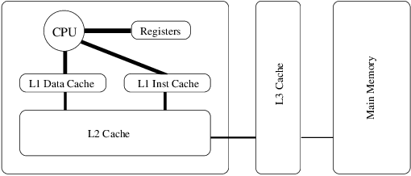

<!--
title: Exercise session 08
paginate: true

_class: titlepage
-->

# Exercise session 08
<br>

## Introduction to CMake.<br>Optimization, debugging, profiling, testing.
<br>

#### Advanced Programming - SISSA, UniTS, 2023-2024

###### Pasquale Claudio Africa

###### 23 Nov 2023

---

<!--
_class: titlepage
-->

# CMake

---

# Exercise 1: CMake

1. Following `exercises/07/solutions/ex1`, compile `muParserX` using CMake and write a `CMake` script to compile and link the test code `ex1.cpp` against it.
2. Re-do `exercises/07/solutions/ex3` with the help of CMake.

---

<!--
_class: titlepage
-->

# Optimization and profiling

---


[Source](https://doi.org/10.3390/electronics12030754)

---

# Memory layout



---

# Data structure alignment

```cpp
class MyClass
{
  char a;      // 1 byte.
  short int b; // 2 bytes.
  int c;       // 4 bytes.
  char d;      // 1 byte.
};
```

<div class="columns">
<div>

## How data is *not* stored


</div>
<div>

## How data is actually stored


</div>

---

# Access patterns and loop tiling (for a row-major matrix)


---

# Examples

The folder `examples/optimization` contains three examples:

1. **`data_alignment`** compares the memory occupation of two objects containing the same data members but with different data alignment/padding.
2. **`loop_unrolling`** implements a function that multiplies all elements in a `std::vector` by looping over all its elements and returns the result. The executable compares the performance with those obtained exploiting loop unrolling.
3. **`static`** implements a function that allocates a `std::vector` and, taking an index as input, returns the corresponding value. The executable compares the performance with those obtained by declaring the vector `static`.

---

# Exercise 2: Optimization

The `hints/ex2/` directory contains the implementation of a class for dense matrices organized as **column-major**.

- Implement `Matrix::transpose()`, a method to compute $A = A^T$.
- Implement `operator*`, a function to compute matrix-matrix multiplication.
- Optimize the matrix-matrix multiplication by transposing the first factor before the computation. Compare the execution speed with the previous implementation.
- Use `valgrind --tool=callgrind` to generate a profiler report.
- Generate a coverage report using `lcov` and `genhtml`.

---

<!--
_class: titlepage
-->

# Debugging

---

# Examples

The content of `examples/debug` was inspired by [this repository](https://github.com/cme212/course/tree/master/notes/lecture-01) and shows basic techniques for debugging as well as an introduction to `gdb`.

## Further readings
- [Defensive programming and debugging](https://gjbex.github.io/Defensive_programming_and_debugging/).
- [Cpp Undefined Behaviour 101](https://mohitmv.github.io/blog/Cpp-Undefined-Behaviour-101/)
- [Shocking Undefined Behaviour In Action](https://mohitmv.github.io/blog/Shocking-Undefined-Behaviour-In-Action/)

---

# Exercise 3: Debugging

The `hints/ex3/` directory contains an implementation of a double-linked list class. The class stores a pointer to the head, and each node (except for the head and the tail, obviously) contains a pointer to the previous and to the next node.

The implementation contains a lot of errors, namely:

1. Compilation and syntax errors.
2. Runtime errors, including a segmentation fault and a problem in printing the list.
3. Memory leaks.
4. Two possible *segmentation fault*s, not captured by the `main`.

With the help of `gdb` and `valgrind`, solve all these issues and make the code working!

---

<!--
_class: titlepage
-->

# Testing

---

# Exercise 4: Testing

The `hints/ex4/` contains a static function to compute the mean of a `std::vector`.

Following the given directory structure and using [Google Test](https://google.github.io/googletest/), fill in the missing parts in `tests/mean.cpp` to check that the function behaves as expected in all the listed cases.

To run the testsuite type
```bash
make test
```
or
```bash
ctest
```
from the CMake build folder.

