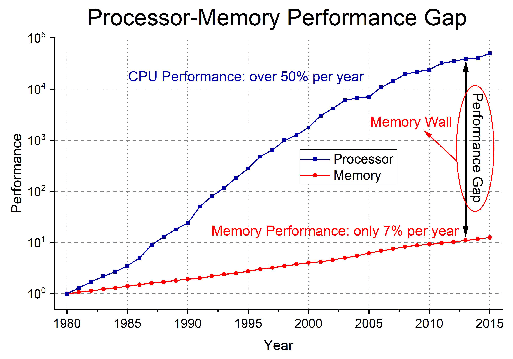
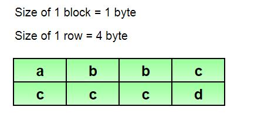
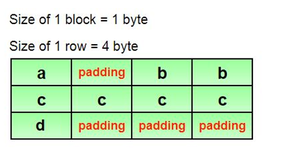

<!--
title: Exercise session 08
paginate: true

_class: titlepage
-->

# Exercise session 08
<br>

## Introduction to CMake.<br>Optimization, debugging, profiling, testing.
<br>

#### Advanced Programming - SISSA, UniTS, 2023-2024

###### Pasquale Claudio Africa

###### 23 Nov 2023

---

<!--
_class: titlepage
-->

# CMake

---

# Exercise 1: CMake

---

<!--
_class: titlepage
-->

# Optimization

---



[Source](https://doi.org/10.3390/electronics12030754)

---

# Memory layout


---

# Data structure alignment

```cpp
class MyClass
{
  char a;      // 1 byte.
  short int b; // 2 bytes.
  int c;       // 4 bytes.
  char d;      // 1 bytes.
}
```

<div class="columns">
<div>

## How data is *not* stored


</div>
<div>

## How data is actually stored


</div>

---

# Access patterns and loop tiling (for a row-major matrix)


---

# Examples

The folder `examples/optimization` contains three examples:

1. **`data_alignment`** compares the memory occupation of two objects containing the same data members but with different data alignment/padding.
2. **`loop_unrolling`** implements a function that multiplies all elements in a `std::vector` by looping over all its elements and returns the result. The executable compares the performance with those obtained exploiting loop unrolling.
3. **`static`** implements a function that allocates a `std::vector` and, taking an index as input, returns the corresponding value. The executable compares the performance with those obtained by declaring the vector `static`.

---

# Exercise 2: Optimization

The `hints/ex2/` directory contains the implementation of a class for dense matrices organized as **column-major**.

Implement the following operations:
- `transpose()` $A = A^T$.
- `operator*`: matrix-matrix multiplication.

---

# Exercise 2: Optimization (hints)

- Transpose the first factor in matrix multiplication before performing the product.
- Compare the execution speed with the previous implementation.
- Generate a coverage report using `lcov` and a profiling check using `valgrind`.

---

<!--
_class: titlepage
-->

# Debugging

---

# Examples

The content of `examples/debug` was inspired by [this repository](https://github.com/cme212/course) and shows basic techniques for debugging as well as an introduction to `gdb`.

## Further readings
- [Defensive programming and debugging](https://gjbex.github.io/Defensive_programming_and_debugging/).
- [Cpp Undefined Behaviour 101](https://mohitmv.github.io/blog/Cpp-Undefined-Behaviour-101/)
- [Shocking Undefined Behaviour In Action](https://mohitmv.github.io/blog/Shocking-Undefined-Behaviour-In-Action/)

---

# Exercise 3: Debugging

linked list

1. Compilation errors
2. Runtime errors (including a segmentation fault)
- a memory leak
- a possible segmentation fault, not captured by the main

---

# Exercise 3: Debugging (hints)


print: current = nullptr
what happens if you try to erase a node not present in the list?)

---

<!--
_class: titlepage
-->

# Profiling

---

# Exercise 4: Profiling

generate coverage report

---

<!--
_class: titlepage
-->

# Testing

---

# Exercise 5: Testing

use Google Test

---

